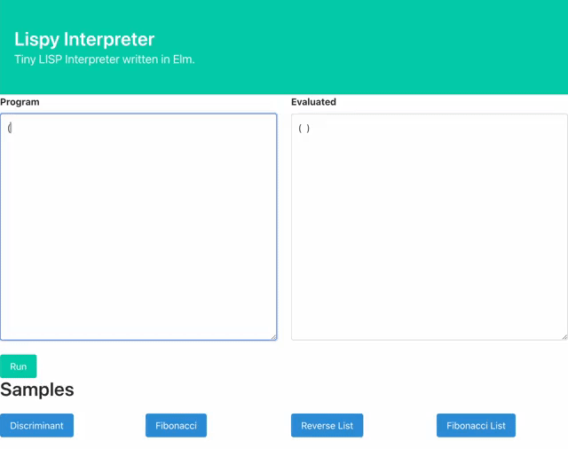

# Tiny Lisp Interpreter written in Elm

This work is based on _[(How to Write a (Lisp) Interpreter (in Python))](http://norvig.com/lispy.html)_.



## Deployment
`elm make src/* --output deployment/index.js --optimize`

Make sure you have an ACM certificate and S3 buckets.

```
ACM_CERTIFICATE_ARN=<Your arn for the certificate>
DOMAIN_NAME=<your domain name>
LOGGING_BUCKET_NAME=<your logging bucket name>
CONTENT_BUCKET_NAME=<your content bucket name>

aws s3 cp --recursive deployment s3://${CONTENT_BUCKET_NAME}

aws cloudformation deploy \
  --template-file cloudformation_templates/main.yml \
  --stack-name lispy \
  --parameter-override \
    DomainName=${DOMAIN_NAME} \
    LoggingBucketName=${LOGGING_BUCKET_NAME} \
    ContentBucketName=${CONTENT_BUCKET_NAME} \
    AcmCertificateArn=${ACM_CERTIFICATE_ARN}
```

Configure DNS server.
